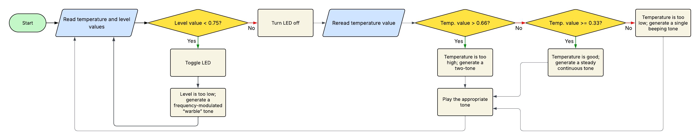
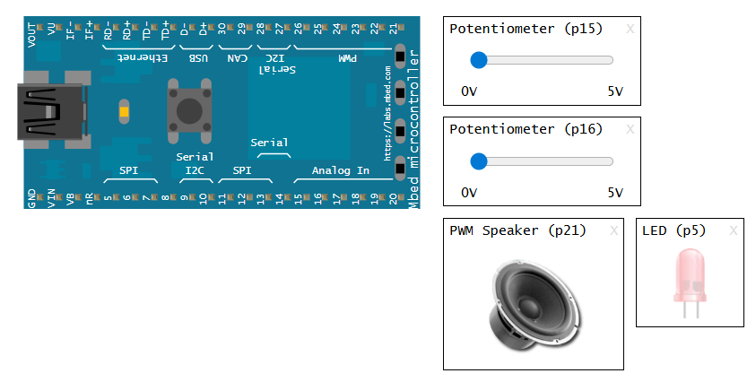

# Mbed Heating Tank Monitor
## Summary
The purpose of this project is to develop a monitoring system for a heating tank in an industrial process and simulate this using the Mbed simulator. This tank consists of two sensors, one for temperature and the other for level. Furthermore, there are four output states that must be detected, each triggering a different audible status tone:

**1. Tank is full, temperature too high (upper third of temperature range)**: two-tone

**2. Tank is full, temperature is good (middle third of temperature range)**: steady continuous tone

**3. Tank is full, temperature too low (lower third of temperature range)**: single beeping tone

**4. Tank level is too low (tank less than three quarters full), any temperature**: frequency-modulated “warble” tone, flashing LED

## Inputs & Outputs
Given this information, the inputs and outputs should be as follows:

### Inputs
- **Potentiometer 1**: Tank temperature
- **Potentiometer 2**: Tank level

### Outputs
- **LED**: Tank level indicator
- **PWM Speaker**: Tone output

## Flowchart

  

Figure 1: Flowchart diagram for the Mbed heating tank monitor.

## Project Setup
These are the components used to allow the project to run successfully.

  

Figure 2: Components added for the Mbed heating tank monitor.

- **p5**: LED used to indicate the tank level is too low
- **p15**: Potentiometer for the tank temperature
- **p16**: Potentiometer for the tank level
- **p21**: Speaker used to generate the appropriate sound signals
